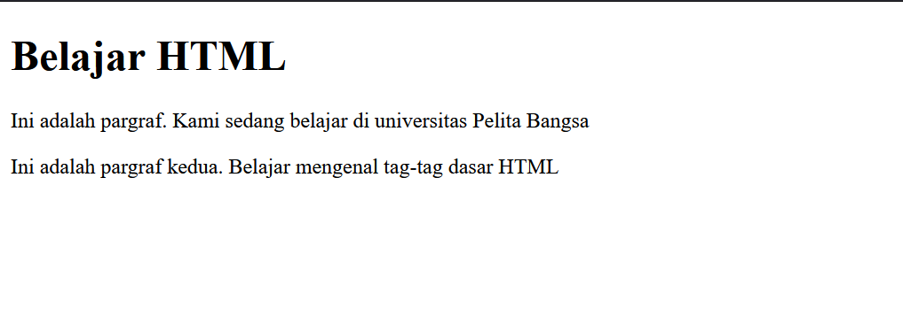
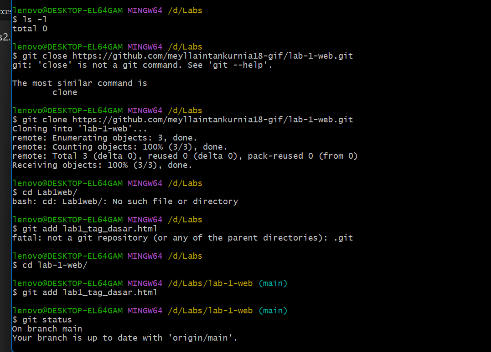
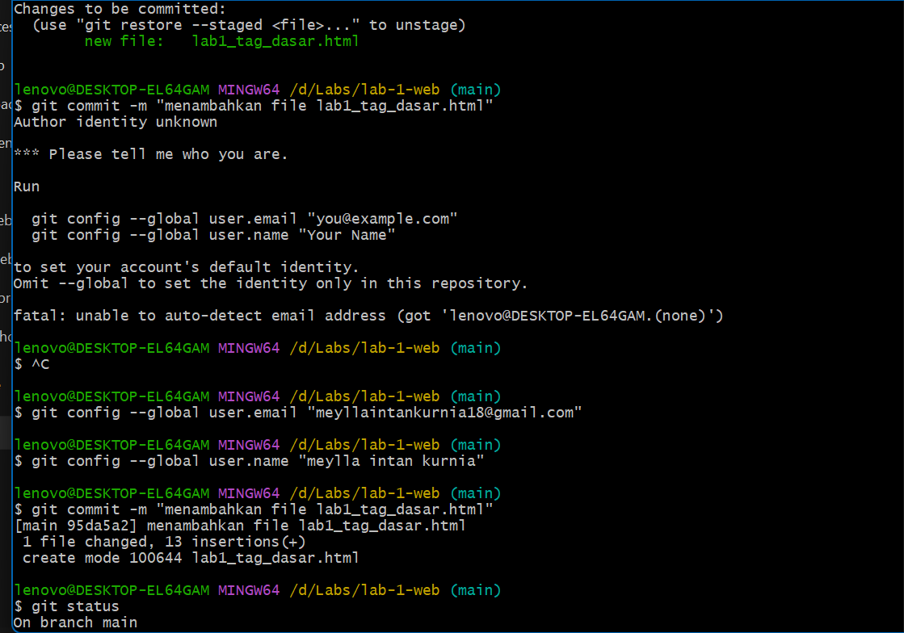
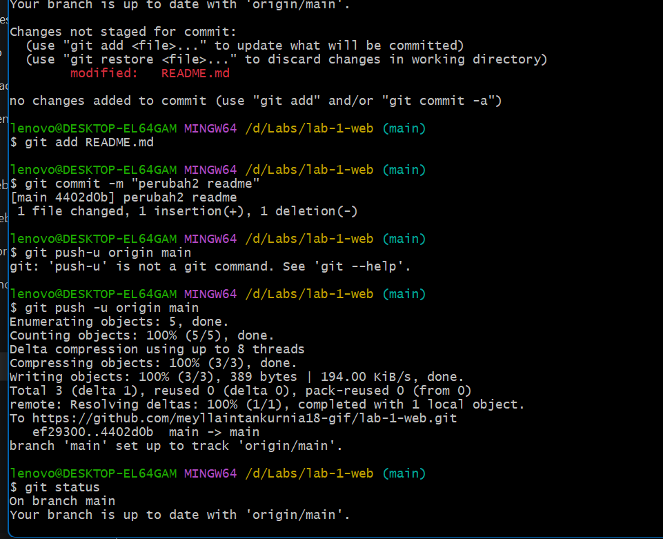
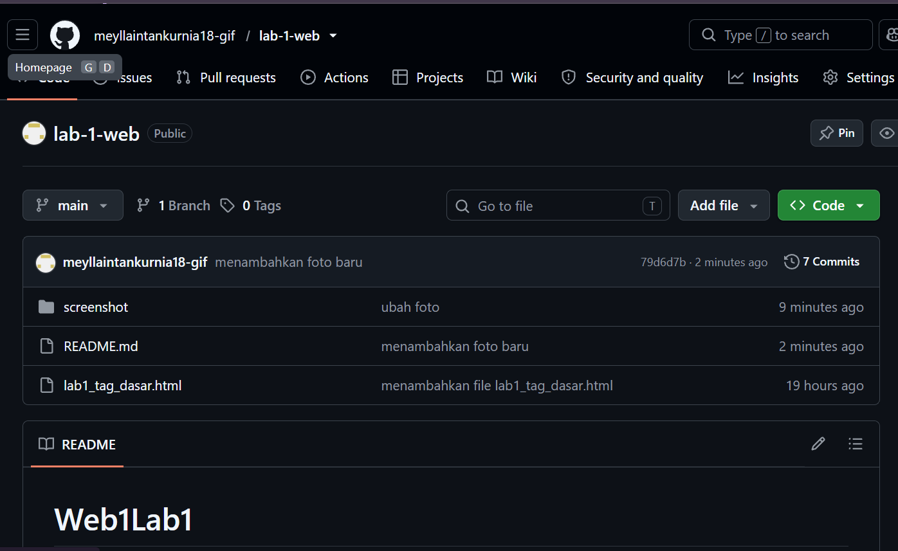

# Web1Lab1
## Belajar Tag Dasar HTML

### Membuat Paragraf
kode tag untuk paragraf adalah 

ini adalah tampilannya

Lalu buka git =scm 

ketikkan seperti gambar di bawah ini

Setelah itu, akan muncul layar seperti ini:

Berikutnya, klil sign In With Your Browser 

Lalu masuk melalui akun google 

dan klik Autorized git-ecosystem

Dan setelahnya, muncul halaman seperti ini di GitHub 

Itu tandanya kalian sudah berhasil membuat Git Version Control menggunakan Github
